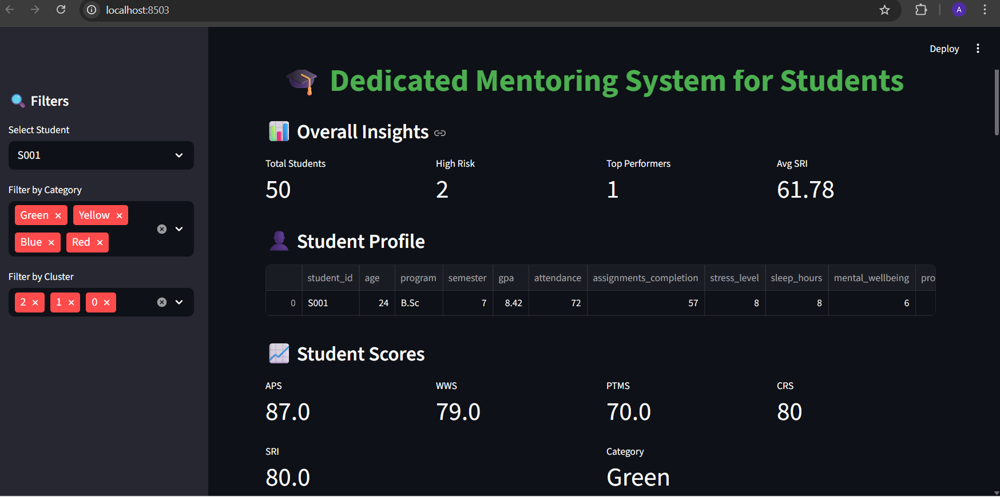
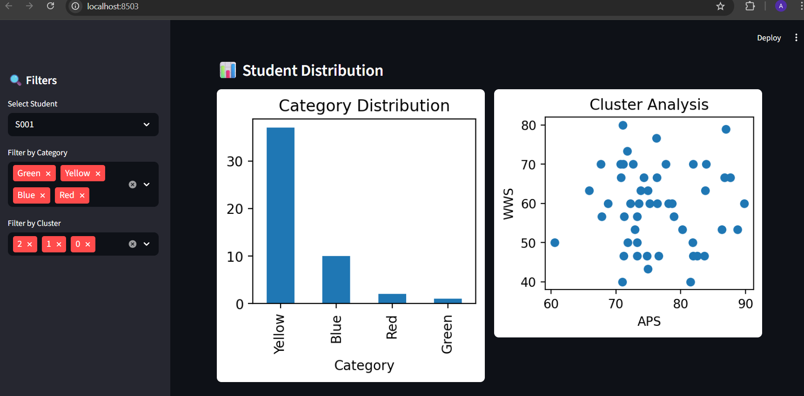
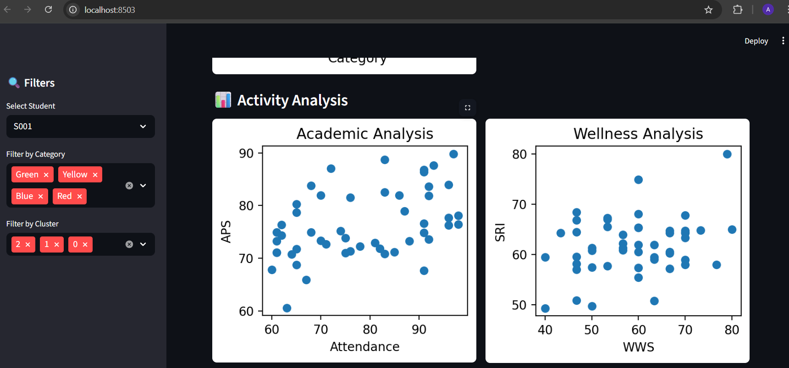
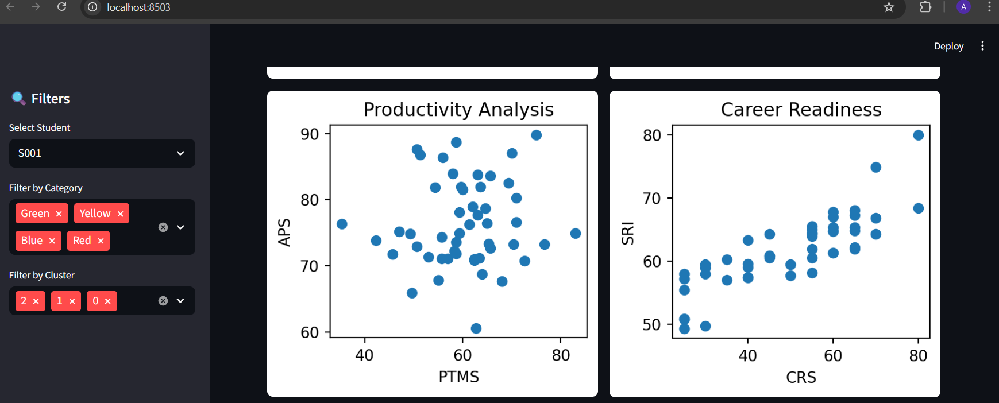
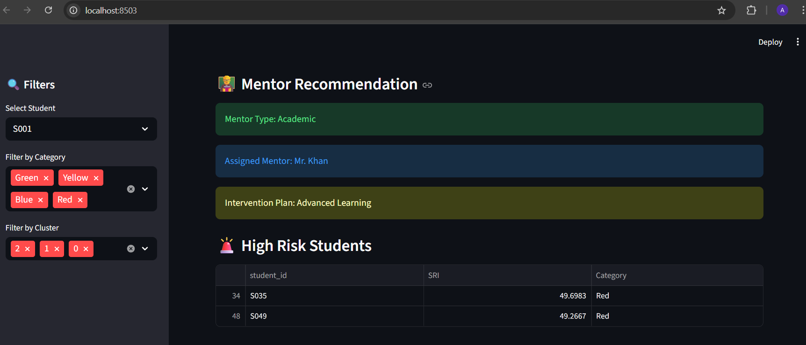
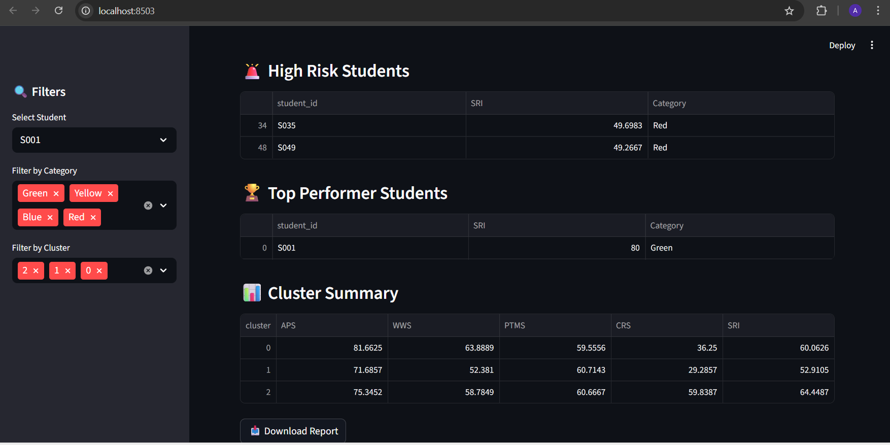

# Dedicated Mentoring System for Students

## Overview

The Dedicated Mentoring System for Students is an AI based project designed to analyze student academic, wellness, productivity, and career data to provide personalized mentoring recommendations. The system identifies students who may need additional support and recommends suitable mentors along with appropriate intervention strategies.

This project demonstrates how data analysis and machine learning techniques can help educational institutions support students through early identification of academic or personal challenges.

## Key Features

* Student performance analysis
* Rule based scoring system for student readiness
* Student clustering using machine learning
* Mentor student matching system
* Intervention recommendation engine
* Interactive dashboard built using Streamlit

## Technologies Used

* Python
* Pandas
* NumPy
* Scikit-learn
* Matplotlib
* Seaborn
* Streamlit

## Project Structure

```
project/
│
├── app.py
├── students.csv
├── students_scored.csv
├── mentors.csv
├── final_student_recommendations.csv
├── mentor_matching_logic.ipynb
├── requirements.txt
└── README.md
```

## System Workflow

### 1. Dataset Creation

A synthetic dataset of students is created containing attributes related to academic performance, wellbeing, productivity, and career readiness.

### 2. Student Scoring System

Student performance is evaluated using multiple scores:

* Academic Performance Score (APS)
* Wellness and Wellbeing Score (WWS)
* Productivity and Time Management Score (PTMS)
* Career Readiness Score (CRS)
* Student Readiness Index (SRI)

Students are categorized into four groups:

* Green
* Blue
* Yellow
* Red

### 3. Student Segmentation

Machine learning techniques are used to identify patterns among students:

* Data preprocessing and normalization
* KMeans clustering
* Cluster visualization using PCA

### 4. Mentor Matching and Recommendations

Students are matched with mentors based on:

* Student needs
* Mentor expertise
* Mentor availability

The system generates:

* Mentor recommendation
* Intervention plan
* High risk alerts

## Datasets

### students.csv

Contains student data including academic and behavioral indicators.

### students_scored.csv

Dataset containing calculated student performance scores.

### mentors.csv

Dataset containing mentor information such as expertise and availability.

### final_student_recommendations.csv

Final output dataset containing:

* student id
* student scores
* category
* assigned mentor
* intervention recommendation

## Running the Project

### Clone the Repository

```
git clone https://github.com/your-username/dedicated-mentoring-system.git
cd dedicated-mentoring-system
```

### Install Dependencies

```
pip install -r requirements.txt
```

### Run the Streamlit Application

```
streamlit run app.py
```

## Project Output

The system provides:

* student performance insights
* clustering based student analysis
* mentor recommendations
* intervention strategies
* risk alerts for struggling students

## Dashboard Overview
Main Dashboard Showing Student Insights, Profile, and Performance Scores


## Student Category Distribution and Cluster Analysis

Visualization of student categories (Green, Blue, Yellow, Red) and clustering based on academic performance and wellbeing scores.



## Academic and Wellness Analysis

Visualization showing the relationship between attendance and academic performance, and the impact of wellbeing score on the Student Risk Index.



## Productivity and Career Readiness Analysis

Visualization showing the relationship between student productivity and academic performance, and the impact of career readiness score on the Student Risk Index.



## Mentor Recommendation and High Risk Student Identification

AI based mentor assignment with intervention plans, along with identification of students who require immediate mentoring support.



## Top Performer Students, Cluster Summary, and Report Generation

Displays students identified as top performers, the average performance scores of each cluster, and the option to download the student mentoring report.




## Future Improvements

* Integration with real educational datasets
* Advanced predictive analytics
* Real time mentor availability
* Cloud deployment for universities
* Integration with student management systems

## Author

This project was developed as part of an AI and Machine Learning internship project focusing on building intelligent mentoring support systems for students.
